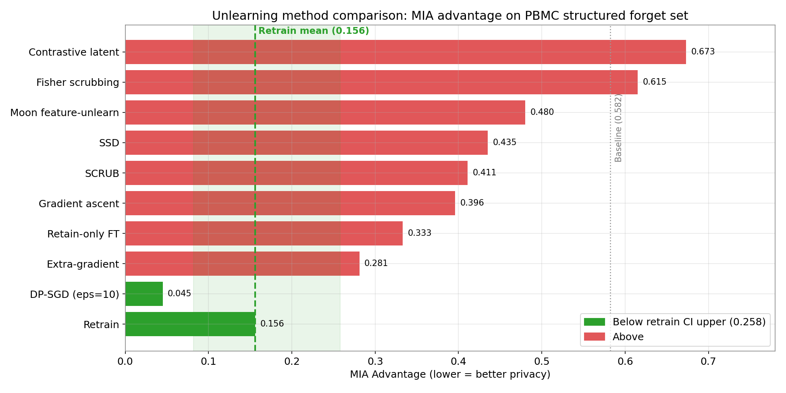
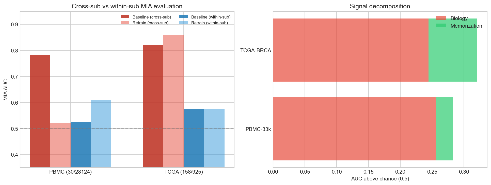
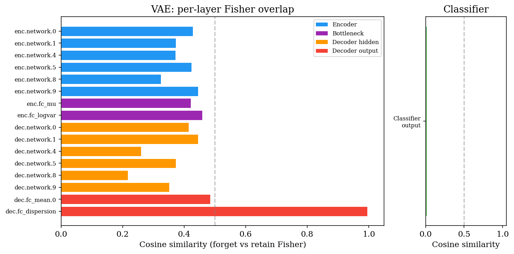
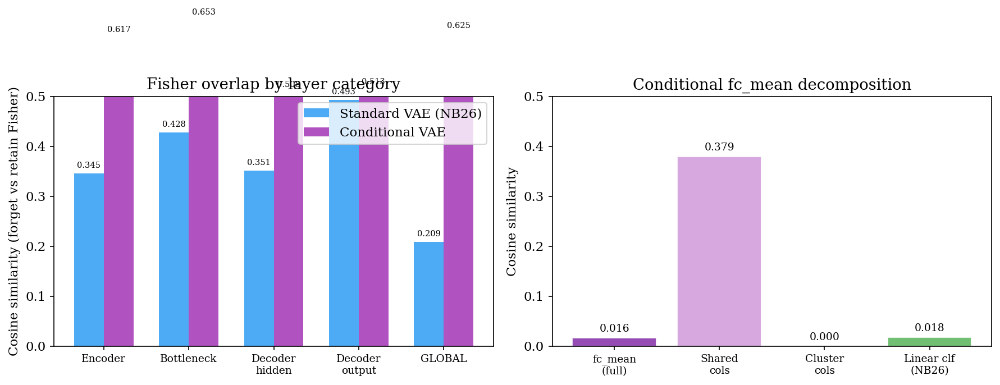

# Fishing for Privacy: Machine Unlearning for Gene-Expression VAEs

**David Benson**
Columbia University
dmb2262@columbia.edu

## Abstract

Single-cell RNA sequencing and bulk RNA-seq models can memorize individual training samples, which is a problem when the data contains sensitive biological information. This paper tests whether machine unlearning can remove specific samples from a variational autoencoder (VAE) so that membership inference attacks (MIAs) can no longer detect them. Eight unlearning methods plus two constructive approaches (training-time synthetic augmentation and representation alignment against a retrain reference) were evaluated against four attack families on three datasets (PBMC-33k and Tabula Muris single-cell, TCGA-BRCA bulk RNA-seq). All eight methods fail on structured (biologically coherent) forget sets. Methods that treat unlearning as a small parameter perturbation (retain-only fine-tuning, gradient ascent, SSD, SCRUB) preserve utility perfectly but produce no measurable privacy improvement. Fisher scrubbing and contrastive latent unlearning make the model detectably worse rather than detectably better. Extra-gradient co-training shows high variance across seeds (mean advantage = 0.300, nested 95% CI [0.216, 0.383]). DP-SGD trained from scratch on the retain set comes closest to the multi-seed retrain baseline (advantage = 0.072 vs. 0.148), but at a real utility cost and by construction, not by unlearning. Synthetic augmentation shifts memorization bias to the seed samples; representation alignment creates a detectable Streisand effect. The core finding is that memorization concentrates in biologically coherent subpopulations. Structured clusters show baseline MIA AUC of 0.78–0.89, while scattered random cells show 0.41–0.53. A within-subtype matching analysis shows that standard cross-subtype matched negatives overestimate above-chance memorization by 30–90% on both scRNA and bulk RNA data. A Fisher information analysis reveals the structural cause: the VAE's shared decoder produces 17× higher Fisher overlap between forget and retain sets than a classifier on the same data (0.306 vs. 0.018 on PBMC; 0.905 on TCGA-BRCA), so selective parameter perturbation cannot cleanly separate the two. Proposition 1 formalizes this for linear decoders, with scaling bounds showing generative-model overlap grows as 1 − O(M/D) while classifier overlap scales as 1/√C. Full retraining remains the only dependable option for structured forget sets.

## 1. Introduction

Deep learning models memorize training data, and for rare subpopulations this memorization may be necessary for generalization (Feldman 2020). When those models are trained on sensitive biological information, an attacker can determine whether a specific sample was part of the training set through a membership inference attack (MIA).

This paper tests machine unlearning for VAEs trained on gene-expression data, where expression profiles can reveal disease status, genetic predispositions, and other personal health information. The work addresses subpopulation unlearning, meaning the removal of entire biological groups such as rare cell types or disease subtypes, not individual samples. Experiments use cell-type clusters (PBMC, Tabula Muris) and disease subtypes with per-patient annotations (TCGA-BRCA) as forget sets.

Privacy leakage is measured by membership inference advantage (adapted from Yeom et al. 2018): $\text{advantage} = 2|\text{AUC} - 0.5|$. This is direction-agnostic, so $\text{AUC} = 0.38$ (over-unlearning) and $\text{AUC} = 0.62$ (under-unlearning) both give advantage $= 0.24$. Unlearning is judged against a multi-seed retrain reference by one-sided Welch's $t$-test with Holm–Bonferroni correction across methods. A method fails when its per-seed advantages are significantly greater than the retrain distribution after correction.

**Contributions.**

1. An evaluation methodology for MIAs on biological generative models that quantifies the biology confound. Standard cross-subtype matched negatives overestimate the above-chance memorization signal by 30–90% (computed as the fraction of the AUC-above-0.5 signal attributable to subtype identity rather than training membership). Within-subtype matching, attack diversity analysis, and retrain-baseline comparison separate the two signals.
2. Evidence across three datasets and two modalities (single-cell and bulk RNA-seq) that memorization concentrates in biologically coherent subpopulations (baseline MIA AUC of 0.78–0.89 for structured sets, 0.41–0.53 for scattered), and that no baseline-vs-retrain gap is detectable on TCGA-BRCA after controlling for the biology confound.
3. A systematic comparison of eight unlearning methods plus two constructive approaches (training-time synthetic augmentation and representation alignment unlearning), all evaluated with both cross-subtype and within-subtype matching. All ten approaches fail. Synthetic augmentation shifts the memorization bias rather than removing it. Representation alignment creates a detectable Streisand effect.
4. A Fisher information analysis explaining the structural cause. The VAE's shared decoder creates 17× higher Fisher overlap than a classifier (0.306 vs. 0.018 on PBMC; 0.905 on TCGA-BRCA). Proposition 1 formalizes this for linear decoders, with dimensional scaling bounds showing generative-model overlap grows as 1 − O(M/D) while classifier overlap scales as 1/√C.
5. A multi-seed retrain reference and reproducible nested-bootstrap pipeline. Single-seed retrain evaluation systematically underestimates the retrain floor advantage by ~3× (0.046 vs. 0.148).

## 2. Datasets

| | PBMC-33k | Tabula Muris | TCGA-BRCA |
|---|---|---|---|
| Type | scRNA-seq | scRNA-seq | bulk RNA-seq |
| Samples | 33,088 cells | 41,647 cells | 1,089 patients |
| HVGs / genes | 2,000 | 2,000 | 978 (LINCS L1000) |
| Clusters / subtypes | 14 | 35 | 5 (PAM50) |
| Train / Unseen | 28,124 / 4,964 | 35,399 / 6,248 | ~925 / ~164 |
| Structured forget set | Cluster 13 (30 megakaryocytes) | Cluster 33 (82 cardiac muscle) | Basal subtype (158 patients) |
| Matched negatives | 194 | 137 | 121 (cross-subtype) / 30 (within-subtype) |

The PBMC-33k dataset consists of 33,088 peripheral blood mononuclear cells from 10x Genomics, preprocessed with Scanpy (Wolf et al. 2018). The Tabula Muris dataset has 41,647 cells from 12 mouse tissues. TCGA-BRCA was obtained from the ELSA Benchmarks (Ozturk et al. 2026), VST-normalized, restricted to the 978 LINCS L1000 landmark genes (Subramanian et al. 2017). Matched negatives are the unseen samples closest to the forget set in baseline latent space (k-NN with k=10).

## 3. Methods

**VAE architecture.** Encoder: input genes through [1024, 512, 128] to latent mean and log-variance (z=32). Decoder reverses this to reconstructed expression via a softmax output layer. Reconstruction loss is MSE on log-normalized counts (Gaussian observation model). Layer normalization and dropout (0.1) after each hidden layer. 7.35M parameters on PBMC, ~4.2M on TCGA-BRCA (978 genes).

**Eight unlearning methods tested:**

1. **Retain-only fine-tuning.** Fine-tune on the retain cells.
2. **Gradient ascent.** Maximize loss on forget set, then fine-tune on retain set.
3. **Frozen critics.** Freeze pre-trained attackers, update VAE to minimize their success.
4. **Extra-gradient co-training.** Min-max game with extragradient updates, TTUR (attacker LR 10× lower than VAE LR), 3 co-trained critics, lambda=10, 50 epochs.
5. **Fisher scrubbing** (Golatkar et al. 2020). Perturb parameters inversely proportional to Fisher curvature.
6. **SSD** (Foster et al. 2024). Dampen parameters proportional to forget-set Fisher importance.
7. **Contrastive latent.** Push forget-set latent representations toward prior N(0, I), preserve retain-set representations.
8. **SCRUB** (Kurmanji et al. 2023). Teacher-student distillation: match teacher on retain data, diverge on forget data.

**DP-SGD baseline** (Abadi et al. 2016). Trains from scratch on retain set with per-sample gradient clipping and Gaussian noise. Privacy by exclusion, not by unlearning.

**Two constructive approaches:**

- **Training-time synthetic augmentation.** Train a VAE on retain + bootstrap-resampled synthetic forget-class samples generated from k unseen seed cells with Gaussian noise.
- **Representation alignment unlearning (RAU).** Fine-tune the baseline so its posterior on forget samples matches the retrain model's posterior:

  $$\mathcal{L} = \text{ELBO}(\mathcal{R}) + \lambda \cdot \text{KL}\!\left(q_{\text{student}}(z \mid x_f) \,\big\|\, q_{\text{retrain}}(z \mid x_f)\right)$$

  where $\lambda$ controls the alignment strength.

**Attack suite.** Trained MLP attacker (70-dim features = 69 from VAE latent space + k-NN distance to retain), threshold attacks (reconstruction, KL, ELBO), likelihood ratio, k-NN latent.

**Multi-seed retrain reference.** A canonical retrain (LayerNorm encoder/decoder, KL warm-up over 20 epochs, free-bits 0.03 nats/dim, lr=1e-4, 100 epochs) is trained for 5 seeds (42–46). Per-seed evaluation uses a fresh attacker trained on baseline (forget vs. matched negatives). The retrain advantage distribution is summarized by a nested bootstrap: outer resampling of seeds, inner Normal sampling from per-seed sample-bootstrap CIs, 10000 iterations. Method comparisons use one-sided Welch's t-test on per-seed advantages, with Cohen's d as effect size and Holm–Bonferroni correction across the 8 multi-seed methods.

## 4. Results

### 4.1 Main results (PBMC-33k structured forget set)

| Method | Seeds | AUC | Advantage | Marker r | Status |
|---|---|---|---|---|---|
| Baseline (no unlearning) | — | 0.783 | 0.565 | 0.831 | — |
| Retain-only fine-tune | 5 | 0.665 ± 0.007 | 0.331 | 0.832 | FAIL (d=10.8) |
| Gradient ascent | 5 | 0.702 ± 0.004 | 0.404 | 0.832 | FAIL (d=18.9) |
| SSD (α=1.0) | 3 | 0.725 ± 0.001 | 0.450 | 0.831 | FAIL (d=21.4) |
| SCRUB (α_f=1.0) | 3 | 0.737 ± 0.002 | 0.474 | 0.832 | FAIL (d=23.0) |
| Contrastive latent (γ=1.0) | 3 | 0.153 ± 0.032 | 0.695 | 0.832 | FAIL (Streisand, d=14.0) |
| Fisher scrubbing | 3 | 0.814 ± 0.003 | 0.628 | — | FAIL (worse, d=33.2) |
| Extra-gradient (λ=10) | 10 | 0.429 ± 0.142 | 0.300 | 0.789 | FAIL (d=1.7) |
| DP-SGD (ε=10) | 3 | 0.464 ± 0.024 | 0.072 | 0.787 | Passes\* |
| **Full retrain (multi-seed)** | **5** | **0.574 ± 0.009** | **0.148** | **0.829** | **TARGET** |

The multi-seed retrain reference has advantage 0.148 with nested 95% CI [0.070, 0.229]. Seven of eight post-hoc unlearning methods reject H₀: method ≤ retrain at p < 0.01 after Holm–Bonferroni correction (Cohen's d ≥ 1.7).

\*DP-SGD's advantage 0.072 falls below the retrain mean 0.148, so the Welch test cannot reject H₀ in the worse-than-retrain direction. But DP-SGD trains from scratch with formal differential privacy; the forget set was never in training. It is privacy by exclusion, not unlearning.

*MIA advantage by method on PBMC-33k structured forget set. The dashed line marks the 5-seed retrain advantage mean (0.148) with shaded nested 95% CI [0.070, 0.229]. No post-hoc unlearning method reaches the retrain CI.*

**Failure modes.** Methods that treat unlearning as a small parameter perturbation (retain-only fine-tuning, gradient ascent, SSD, SCRUB) preserve utility almost perfectly (marker $r \ge 0.831$, matching baseline) but produce no measurable privacy improvement. Thirty forget-set cells leave too small a gradient signal relative to the $28{,}094$ retain cells. Fisher scrubbing and contrastive latent unlearning create detectable artifacts: contrastive AUC drops to $0.153$ (Streisand effect), Fisher KL collapses from $10.55$ to $0.007$ on the forget set. Extra-gradient has high per-seed variance ($\sigma_{\text{AUC}} = 0.142$) and the nested CI overlaps the retrain CI from above; Welch still rejects ($d = 1.67$), so the mean advantage is reliably above retrain despite the variance.

### 4.2 Fisher by forget set type

Fisher achieves AUC = 0.499 on scattered sets (near chance, but baseline is already 0.525) and AUC = 0.814 on structured sets (worse than baseline). The memorization problem concentrates in structured subpopulations, and Fisher fails where it is most needed.

### 4.3 Cross-dataset validation (Tabula Muris)

The Tabula Muris retrain model has AUC = 0.944, exceeding the baseline (0.891). Since retrain never saw cluster 33, this proves the attacker is detecting cardiac muscle cell biology rather than membership. The TM evaluation does not measure membership leakage at all; it measures how distinctively the model represents the cardiac muscle transcriptional signature.

This reframes the TM unlearning numbers. Extra-gradient AUC = 0.874 and Fisher AUC = 0.946 are not failures to remove a membership signal; there is no membership signal on TM cluster 33 to remove. They show that no method moves AUC below the retrain ceiling of 0.944, which is exactly what the biology-confound thesis predicts.

### 4.4 TCGA-BRCA and the biology confound

On TCGA-BRCA (1,089 breast cancer patients, bulk RNA-seq), the structured forget set is 158 Basal-subtype patients (17% of training). With standard cross-subtype matching, baseline AUC = 0.821 and retrain AUC = 0.860. The retrain model, which never saw the Basal patients, is *better* at detecting them than the baseline. All six tested unlearning methods converge to the retrain floor.

Within-subtype matching (restricting matched negatives to 30 unseen Basal patients) resolves the cross-subtype confound. Baseline and retrain advantages both reach ≈ 0.15 and become indistinguishable from each other. The entire cross-subtype gap was driven by Basal identity. The residual within-subtype advantage of 0.15 is not zero, so the attacker still detects something, but whatever it detects is equally present in the retrain model that never saw the Basal patients, and is therefore not membership.

Patient-level experiments at n_f ∈ {5, 10, 20} show the same pattern: baseline and retrain advantages overlap within their CIs at every size, with no consistent gap.

This confound is not unique to TCGA-BRCA. On PBMC, within-cluster matching (5 unseen megakaryocytes) drops baseline AUC from 0.769 to 0.527. Approximately 90% of the cross-cluster above-chance signal on PBMC and 76% on TCGA-BRCA is attributable to subtype identity rather than memorization. Replication on PBMC cluster 7 (CD14+ monocytes, 80 unseen cells) gives a confound fraction of 84%, consistent with the cluster-13 estimate and removing the dependence on a 5-cell holdout. Tabula Muris cluster 28 (67 unseen) shows no detectable per-sample memorization under either matching strategy.

*Biology confound across datasets. Cross-subtype vs. within-subtype MIA AUC for PBMC and TCGA-BRCA. With within-subtype matching, baseline and retrain AUCs converge.*

### 4.5 Constructive approaches

**Synthetic augmentation at training time.** If memorization concentrates in rare subpopulations, augmenting those subpopulations with synthetic data during training might prevent sample-level memorization while preserving subtype biology. VAEs trained on retain + bootstrap-resampled synthetic megakaryocytes (generated from 5 unseen seed cells with Gaussian noise) were compared to baseline and retrain. On PBMC with within-cluster matching, the augmented model achieves AUC = 0.82–1.00, *worse* than baseline (0.63). The model's representation of the megakaryocyte region is now shaped by the 5 seed cells rather than the 30 training cells, and the MIA detects this shift. Augmentation replaces one memorization pattern with another rather than eliminating memorization. On TCGA-BRCA with within-subtype matching, the augmented model (0.581) is indistinguishable from baseline (0.578) and retrain (0.573), consistent with the absence of patient-level memorization.

**Representation alignment unlearning (RAU).** Instead of modifying parameters directly, RAU fine-tunes the baseline so its posterior on forget samples matches the retrain model's posterior. The retrain model provides the counterfactual representation, with no memorization by construction. A sweep over $\lambda \in \{0.1, 1.0, 10.0, 100.0\}$ successfully aligns posteriors (KL to retrain drops from $139$ to $0.02$), but cross-cluster AUC drops to $0.10$–$0.13$, a Streisand effect. The representational shift is itself a detectable membership signal. The structural limit extends to representation space: any modification to the model's treatment of forget samples, whether in parameter space (Fisher, SSD) or representation space (RAU, contrastive), creates a detectable trace.

### 4.6 Utility evaluation

Five methods (retain-FT, gradient ascent, SSD, SCRUB, contrastive) preserve utility identically to baseline (ELBO ≈ 364, marker r ≥ 0.831). These methods barely change the model, which is why they fail on privacy. Extra-gradient and DP-SGD trade utility for privacy (ELBO ≈ 403, marker r ≈ 0.789). Fisher is worst (ELBO = 490, marker r = 0.628, KL = 0.007 due to posterior collapse).

## 5. Why parameter-space methods fail (Fisher information analysis)

### 5.1 Fisher overlap across architectures

The diagonal Fisher was computed on the forget set and retain set from the baseline PBMC model.

| Layer category | Parameters | PBMC cosine |
|---|---|---|
| Encoder | 2,642,816 | 0.273 |
| Bottleneck | 8,256 | 0.291 |
| Decoder hidden | 598,912 | 0.232 |
| Decoder output | 4,100,000 | 0.362 |
| **VAE global (PBMC)** | **7,349,984** | **0.306** |
| **VAE global (TCGA-BRCA)** | **~4.2M** | **0.905** |
| **Linear classifier** | **462** | **0.018** |
| **Deep MLP classifier** (shared hidden / class-specific output) | **1.09M** | **0.262 / 0.010** |

The 17× gap between VAE (0.306) and classifier (0.018) on PBMC arises because the VAE's output layer is shared across all 2,000 genes, while the classifier's output weights are specific to each of the 14 classes. On TCGA-BRCA the gap grows further because the forget fraction (158/925) is larger relative to the output dimension (978). Per Corollary 2 (below), this is the predicted scaling.

*Per-layer Fisher cosine on PBMC. The decoder output is the largest contribution to the global gap.*

### 5.2 Proposition 1 (Fisher factorization for linear decoders)

**Proposition 1.** Let $f(z) = Wz + b$ be a linear decoder with $W \in \mathbb{R}^{D \times H}$, $b \in \mathbb{R}^D$, and squared-error loss $\ell(x, f(z)) = \tfrac{1}{2}\|x - f(z)\|^2$. Let $e_d = x_d - f_d(z)$ denote the per-output residual and $z_h$ the per-hidden-unit latent activation. Under the empirical Fisher with element-wise independence,

$$F_{dh} \;=\; 4\,\mathbb{E}\!\left[e_d^{\,2}\right]\,\mathbb{E}\!\left[z_h^{\,2}\right]\,.$$

Define the residual variance profile $\sigma \in \mathbb{R}^D$ and the latent second moment $\nu \in \mathbb{R}^H$ by

$$\sigma_d \;=\; \mathbb{E}\!\left[e_d^{\,2}\right]\,, \qquad \nu_h \;=\; \mathbb{E}\!\left[z_h^{\,2}\right]\,.$$

Then for any two distributions $\mathcal{F}$ (forget) and $\mathcal{R}$ (retain) the Fisher cosine factorizes as

$$\cos\!\left(F^{\mathcal{F}},\,F^{\mathcal{R}}\right) \;=\; \cos\!\left(\sigma^{\mathcal{F}},\,\sigma^{\mathcal{R}}\right) \cdot \cos\!\left(\nu^{\mathcal{F}},\,\nu^{\mathcal{R}}\right)\,.$$

The forget-vs-retain Fisher overlap thus separates into a *residual-profile* factor (which depends on which output dimensions differ between $\mathcal{F}$ and $\mathcal{R}$) and a *latent-moment* factor (which depends on how the encoder uses each hidden unit). The two factors can be analyzed independently.

### 5.3 Corollary 2 (Dimensional scaling bounds)

**Part (i) — generative model.** Suppose only $M$ of the $D$ output dimensions differ between $\mathcal{F}$ and $\mathcal{R}$, with bounded relative residual variance $V$ on the differing dimensions. Then

$$\cos\!\left(\sigma^{\mathcal{F}},\,\sigma^{\mathcal{R}}\right) \;\ge\; \frac{D - M}{D - M + M V^{2}}\,.$$

For PBMC ($D = 2000$, $M = 100$, $V = 3$) the bound is $0.68$. The data-direct estimate $\cos(\sigma) = 0.83$ satisfies this. The Fisher-marginal estimate $\cos(\sigma) = 0.51$ is lower because the softmax output layer couples output dimensions, departing from the element-wise independence assumed in Proposition 1.

**Part (ii) — single-class classifier forget set.** For a $C$-class classifier whose forget set is one entire class,

$$\cos\!\left(\sigma^{\mathcal{F}},\,\sigma^{\mathcal{R}}\right) \;=\; \frac{1}{\sqrt{C}}\,.$$

For $C = 14$ this gives $0.27$. The measured classifier cosine of $0.018$ is lower still because deep classifiers also concentrate residual variance on the forget-class logit, producing additional anti-alignment beyond the linear bound.

The two parts of the corollary together explain the $17\times$ gap empirically observed on PBMC: generative models scale as $1 - O(M/D)$, classifiers as $O(1/\sqrt{C})$.

### 5.4 Empirical verification

The $W$ matrix of the decoder $\texttt{fc\_mean}$ layer is approximately rank-1: its top singular value explains $94$–$96\%$ of the Frobenius norm. The factorized prediction $\cos(\sigma) \cdot \cos(\nu) = 0.41$ overestimates the measured Fisher cosine $0.37$ by $11\%$, with the softmax nonlinearity as the dominant error source.

### 5.5 Controls

**Model capacity.** A deep MLP classifier ($2000 \to [512, 128] \to 14$, $1.09\text{M}$ parameters, $95.2\%$ accuracy) has shared-hidden cosine $= 0.262$ and class-specific output cosine $= 0.010$. Overlap depends on shared-vs-class-specific structure, not on model size.

**Architecture generalization.** A VAE with $z = 8$ gives global cosine $= 0.846$ (higher than $z = 32$). Smaller latent dimension concentrates overlap in the bottleneck ($0.858$ vs.\ $0.291$).

**Cluster-conditional decoder.** Conditioning the output layer on a $14$-dim cluster one-hot achieves near-zero overlap in the cluster-specific columns ($1.2 \times 10^{-8}$) but irreducible overlap persists in the shared hidden layers (encoder $0.433$, bottleneck $0.508$, decoder hidden $0.346$). Fisher scrubbing on the conditional VAE gives advantage $= 0.72$, no improvement over the standard VAE's $0.63$. The shared encoder dominates because $64$ of $69$ MIA features come from encoder outputs.

*Conditional VAE Fisher overlap by layer category. Cluster-specific output columns achieve disentanglement, but the shared encoder retains overlap.*

## 6. Discussion

Three failure modes emerge:

1. **Methods that preserve utility but produce no privacy improvement** — retain-only fine-tuning, gradient ascent, SSD, SCRUB. Small parameter perturbations cannot reach a memorization signal that is distributed across the entire decoder.
2. **Methods that create detectable artifacts** — contrastive latent unlearning, Fisher scrubbing, frozen critics, RAU. The operation of unlearning itself leaves a trace. Pushing latent representations to an unnatural location, collapsing the posterior, driving the model toward critic-specific blind spots, or aligning forget posteriors to the retrain reference — all create new signals the attacker detects instead.
3. **Methods that trade utility for privacy but cannot reach retrain** — extra-gradient with high variance, DP-SGD with utility cost. These methods do reduce membership signal but at a cost the underlying problem doesn't actually require.

The Fisher overlap analysis identifies the structural cause. Any generative model with shared output parameters will have high Fisher overlap between forget and retain sets, making parameter-space unlearning methods fundamentally harder than in classifiers where class-specific weights create a low-overlap regime.

**Biology vs. membership in MIA evaluation.** Standard MIA evaluation overestimates memorization by 30–90% by conflating subtype identity with training membership. The trained MLP attacker on model-internal features partially separates these signals, with multi-seed retrain advantage ≈ 0.15 (compared to baseline ≈ 0.57), but cross-subtype matching still inflates estimates. Within-subtype matching resolves the confound on both PBMC and TCGA-BRCA.

**Single-seed retrain references are misleading.** The advantage 0.046 commonly reported for canonical retrain on this PBMC setup is a single-seed point estimate. With 5 independently trained retrain seeds following the same protocol, the multi-seed mean is 0.148 with nested 95% CI [0.070, 0.229] — about 3× higher. Single-seed sample bootstrap CIs systematically understate cross-seed variance in retrain training.

**Limitations.** All privacy guarantees here are empirical, not formal (except DP-SGD). Tabula Muris evaluation is confounded by tissue-of-origin signals (retrain AUC = 0.944, exceeding baseline). TCGA-BRCA within-subtype evaluation (30 unseen Basal patients) shows no baseline-vs-retrain gap, limiting its utility for testing unlearning methods that operate on a non-zero gap. Only one generative architecture family (VAE) was tested; whether the Fisher overlap pattern holds for diffusion models or normalizing flows is unknown.

## 7. Conclusion

Standard MIA evaluation overestimates memorization in gene-expression VAEs by 30–90% because it conflates biological subtype identity with training membership. After controlling for this confound, genuine memorization is detectable only on PBMC (multi-seed AUC gap of 0.209, advantage gap of 0.417 between baseline and retrain) and concentrates in rare biological subpopulations. Scattered cells show AUC 0.41–0.53 and barely need unlearning. On TCGA-BRCA with 1,089 breast cancer patients, no baseline-vs-retrain gap was detected with proper matching, even though both models retain a within-subtype advantage of ≈ 0.15 that is unrelated to membership.

All eight approximate unlearning methods fail to remove even the reduced genuine signal on PBMC. Two constructive approaches also fail. Synthetic augmentation during training shifts the memorization bias to the seed samples rather than eliminating it. Representation alignment successfully matches the retrain model's posterior but creates a Streisand effect. The structural cause is Fisher overlap in the shared decoder (cosine = 0.306 on PBMC, 0.905 on TCGA-BRCA), which is 17× higher than the equivalent classifier (0.018). Proposition 1 formalizes this gap, and Corollary 2 shows it scales with the ratio of shared to class-specific output dimensions.

Full retraining remains the only dependable option. The biology confound documented here affects any MIA evaluation on structured biological forget sets and is present in concurrent evaluations of Ozturk et al. (2026) and Golob et al. (2026). Within-subtype matching, attack diversity analysis, and retrain-baseline comparison should be standard practice for privacy evaluation of biological generative models.

## References

- Abadi et al. (2016). Deep Learning with Differential Privacy. CCS.
- Basu et al. (2021). Influence Functions in Deep Learning Are Fragile. ICLR.
- Bourtoule et al. (2021). Machine Unlearning. IEEE S&P.
- Cao & Yang (2015). Towards Making Systems Forget with Machine Unlearning. IEEE S&P.
- Carlini et al. (2022). Membership Inference Attacks From First Principles. IEEE S&P.
- Chavdarova et al. (2019). Reducing Noise in GAN Training with Variance Reduced Extragradient. NeurIPS.
- Cheng et al. (2026). Retain-Forget Entanglement in Machine Unlearning via Wasserstein Regularization. ICLR.
- Feldman (2020). Does Learning Require Memorization? STOC.
- Foster et al. (2024). Fast Machine Unlearning Without Retraining Through Selective Synaptic Dampening. AAAI.
- Ginart et al. (2019). Making AI Forget You: Data Deletion in Machine Learning. NeurIPS.
- Golatkar et al. (2020). Eternal Sunshine of the Spotless Net. CVPR.
- Golob et al. (2026). scMAMA-MIA: A Membership Inference Benchmark for Synthetic Single-Cell RNA-seq Data.
- Guo et al. (2020). Certified Data Removal from Machine Learning Models. ICML.
- Hayes et al. (2024). Inexact Unlearning Needs More Careful Evaluations to Avoid a False Sense of Privacy. SaTML.
- Izzo et al. (2021). Approximate Data Deletion from Machine Learning Models. AISTATS.
- Kunstner et al. (2019). Limitations of the Empirical Fisher Approximation for Natural Gradient Descent. NeurIPS.
- Kurmanji et al. (2023). Towards Unbounded Machine Unlearning. NeurIPS.
- Lopez et al. (2018). Deep Generative Modeling for Single-cell Transcriptomics. Nature Methods.
- Moon et al. (2024). Feature Unlearning for Pre-trained GANs and VAEs. AAAI.
- Nasr et al. (2018). Machine Learning with Membership Privacy Using Adversarial Regularization. CCS.
- Neel et al. (2021). Descent-to-Delete: Gradient-Based Methods for Machine Unlearning. ALT.
- Ozturk et al. (2026). ELSA: A Benchmark for Privacy Evaluation in Generative Models for Bulk RNA-seq.
- Pawelczyk et al. (2025). Machine Unlearning Fails to Remove Data Poisoning Attacks.
- Sekhari et al. (2021). Remember What You Want to Forget: Algorithms for Machine Unlearning. NeurIPS.
- Shokri et al. (2017). Membership Inference Attacks Against Machine Learning Models. IEEE S&P.
- Subramanian et al. (2017). A Next Generation Connectivity Map: L1000 Platform and the First 1,000,000 Profiles. Cell.
- Tabula Muris Consortium (2018). Single-cell Transcriptomics of 20 Mouse Organs Creates a Tabula Muris. Nature.
- Thudi et al. (2022). On the Necessity of Auditable Algorithmic Definitions for Machine Unlearning. USENIX Security.
- Walker et al. (2024). Privacy Risks in Single-Cell Data: Re-identification via eQTL-Based Linking. Cell.
- Wolf et al. (2018). SCANPY: Large-scale Single-cell Gene Expression Data Analysis. Genome Biology.
- Yeom et al. (2018). Privacy Risk in Machine Learning: Analyzing the Connection to Overfitting. CSF.

Code: <https://github.com/db-d2/Machine_Unlearning>
