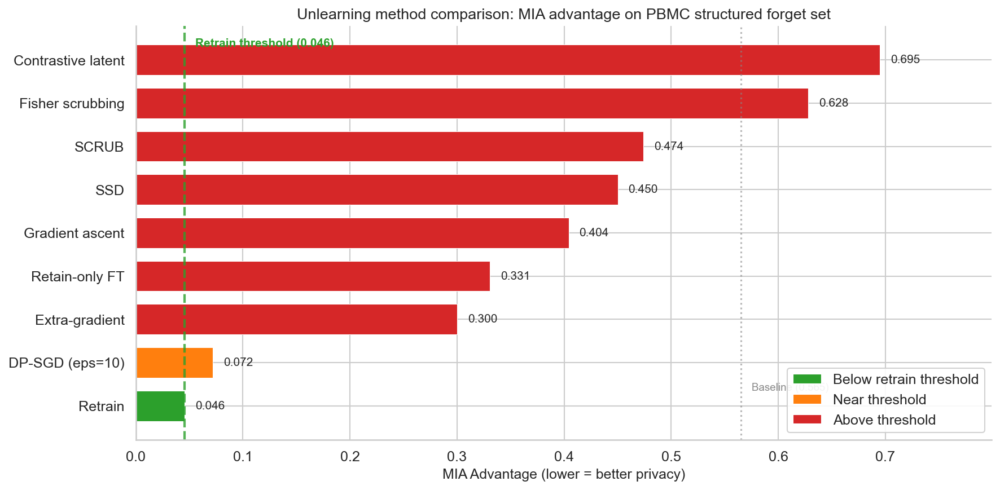
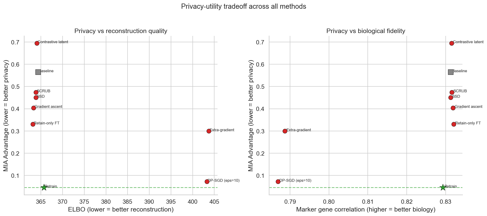
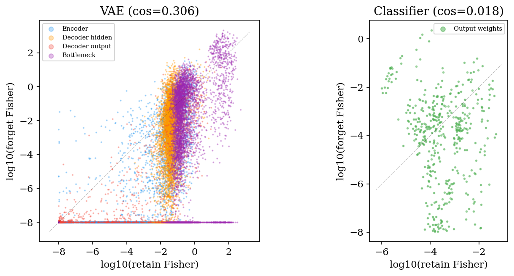

# Machine Unlearning for Single-Cell VAEs

**Eight unlearning methods tested on two scRNA-seq datasets. All fail on structured forget sets. Fisher information analysis explains why.**

STAT 4243 Final Project - Columbia University

[View Code](https://github.com/db-d2/Machine_Unlearning) | [Writeup (Markdown)](./Writeup.md) | [Writeup (PDF)](./Writeup.pdf)

## Abstract

Single-cell RNA sequencing models can memorize individual training samples, creating privacy risks when the data contains sensitive biological information. Eight unlearning methods were evaluated against four attack families on two datasets (PBMC-33k and Tabula Muris). All eight methods fail on structured (biologically coherent) forget sets. Methods that treat unlearning as a small parameter perturbation (retain-only fine-tuning, gradient ascent, SSD, SCRUB) preserve utility perfectly but produce no measurable privacy improvement. Fisher scrubbing and contrastive latent unlearning make the model detectably worse rather than detectably better. Extra-gradient co-training shows high variance across seeds (mean advantage = 0.300, 95% CI [0.226, 0.374]). DP-SGD trained from scratch on the retain set comes closest to the retrain baseline (advantage = 0.072 vs. 0.046), but at a real utility cost and by construction, not by unlearning. A Fisher information analysis reveals the structural cause: the VAE's shared decoder produces 17x higher Fisher overlap between forget and retain sets than a classifier on the same data, so selective parameter perturbation cannot cleanly separate the two. Full retraining remains the only dependable option for structured forget sets.

## Key Results

All methods on PBMC-33k structured forget set (cluster 13, n=30 megakaryocytes). Advantage = 2|AUC - 0.5|. Target: advantage within retrain 95% CI (upper bound = 0.266).

| Method | Seeds | AUC | Advantage | Status |
|--------|-------|-----|-----------|--------|
| Baseline | -- | 0.783 | 0.565 | -- |
| Retain-only fine-tune | 5 | 0.665 | 0.331 | FAIL |
| Gradient ascent | 5 | 0.702 | 0.404 | FAIL |
| SSD | 3 | 0.725 | 0.450 | FAIL |
| SCRUB | 3 | 0.737 | 0.474 | FAIL |
| Contrastive latent | 3 | 0.153 | 0.695 | FAIL (Streisand) |
| Fisher scrubbing | 3 | 0.814 | 0.628 | FAIL (worse) |
| Extra-gradient | 10 | 0.429 | 0.300 | FAIL |
| DP-SGD (eps=10) | 3 | 0.464 | 0.072 | Near target |
| **Retrain** | -- | **0.523** | **0.046** | **TARGET** |

## Main Figures

### MIA Advantage by Method

*MIA advantage by method on PBMC-33k structured forget set. The dashed line marks the retrain advantage (0.046). DP-SGD comes closest (0.072) but trains from scratch. No post-hoc method falls below the threshold.*

### Privacy-Utility Tradeoff

*Left: advantage vs. ELBO. Right: advantage vs. marker gene correlation. Methods that preserve utility fail on privacy; methods that reduce advantage pay a utility cost. Only retrain achieves both.*

### Fisher Information Overlap

*Per-parameter Fisher magnitude (log scale) for forget vs. retain sets. Left: VAE parameters are correlated (log-Fisher r = 0.73). Right: classifier parameters show no correlation (cosine = 0.018).*

## Key Findings

1. **Memorization is structured.** Coherent biological clusters have baseline MIA AUC of 0.78-0.89. Scattered random cells have AUC of 0.41-0.53. The unlearning problem only matters for structured sets.

2. **All eight methods fail.** No approximate method achieves mean advantage within the retrain 95% CI. Four methods produce no privacy improvement. Three create detectable artifacts (Streisand effect). Extra-gradient has high variance and does not generalize to Tabula Muris.

3. **Fisher overlap explains why.** The VAE's shared decoder creates Fisher cosine similarity of 0.306 between forget and retain sets, 17x higher than a classifier (0.018). A proposition formalizes this for linear decoders, with a corollary showing the gap scales as 1 - O(M/D) for generative models vs. O(1/sqrt(C)) for classifiers.

4. **The gap is architectural, not capacity-based.** A deep MLP classifier (1.09M params) has the same low output-layer overlap (0.010) as a linear probe (0.018). Shared hidden layers match VAE encoder overlap (0.262 vs. 0.273). Overlap depends on shared-vs-class-specific parameters.

5. **Reducing latent dimension does not help.** A VAE with z=8 gives higher Fisher overlap (0.846) than z=32 (0.306), driven by the bottleneck (0.858 vs. 0.291).

6. **Conditional decoders are insufficient.** A cluster-conditional VAE achieves near-zero overlap in class-specific output columns (1.2e-8) but irreducible overlap persists in the shared encoder (0.433) and hidden layers (0.346). Fisher scrubbing on the conditional VAE gives no privacy improvement.

## Fisher Overlap Summary

| Layer Category | Parameters | Cosine Similarity |
|---|---|---|
| VAE Encoder | 2,642,816 | 0.273 |
| VAE Bottleneck | 8,256 | 0.291 |
| VAE Decoder hidden | 598,912 | 0.232 |
| VAE Decoder output | 4,100,000 | 0.362 |
| **VAE Global** | **7,349,984** | **0.306** |
| **Classifier** | **462** | **0.018** |

## Documentation

[Writeup (Markdown)](./Writeup.md) | [Writeup (PDF)](./Writeup.pdf) | [LaTeX source](./Writeup.tex)

## Reproducing Results

Run notebooks in numerical order (01-30). Key notebooks:

- **NB01-10**: Data prep, baseline training, initial unlearning experiments
- **NB11-25**: Additional methods, cross-dataset validation, ablations, attack diversity
- **NB26**: Canonical Fisher overlap analysis (VAE vs classifier, damping=1e-8)
- **NB27**: Deep MLP classifier (fair capacity comparison)
- **NB28**: VAE z=8 (architecture generalization)
- **NB29**: Conditional VAE (cluster-specific output columns)
- **NB30**: Proposition 1 verification + conditional VAE scrubbing

---

*STAT 4243 Final Project - Columbia University*
