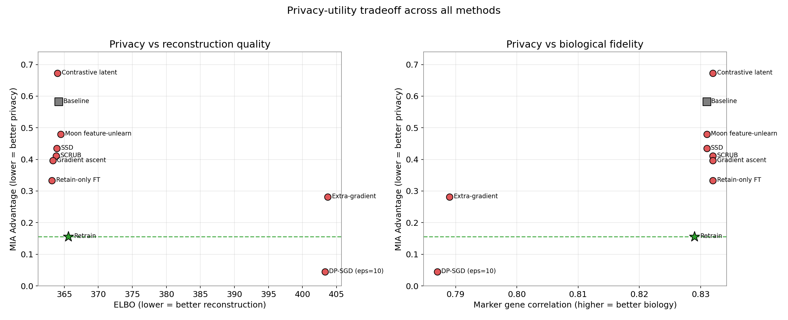
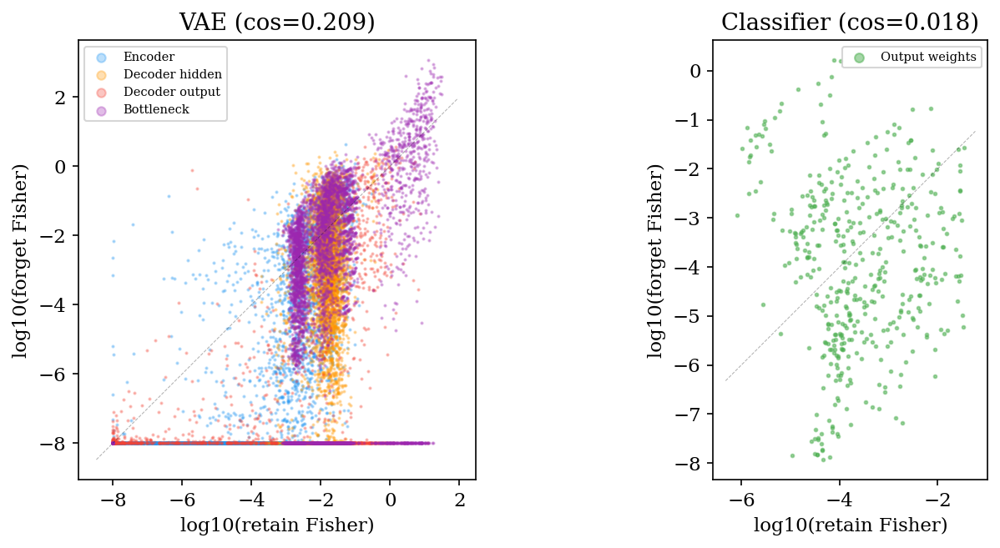

# Fishing for Privacy: Machine Unlearning for Gene-Expression VAEs

**Eight post-hoc unlearning methods plus two constructive approaches, tested on three datasets across two modalities (scRNA-seq and bulk RNA-seq). All eight methods fail. A Fisher information analysis explains why; within-subtype matching shows that standard MIA evaluation overestimates memorization by 30–90% via biology confound.**

David Benson, Columbia University

[View Code](https://github.com/db-d2/Machine_Unlearning) | [Writeup (Markdown)](./Writeup.md) | [Writeup (PDF)](./Writeup.pdf)

## Abstract

Single-cell RNA sequencing and bulk RNA-seq models can memorize individual training samples, which is a problem when the data contains sensitive biological information. This paper tests whether machine unlearning can remove specific samples from a variational autoencoder (VAE) so that membership inference attacks (MIAs) can no longer detect them. Eight unlearning methods plus two constructive approaches (training-time synthetic augmentation and representation alignment against a retrain reference) were evaluated against four attack families on three datasets (PBMC-33k and Tabula Muris single-cell, TCGA-BRCA bulk RNA-seq). All eight methods fail on structured (biologically coherent) forget sets. Methods that treat unlearning as a small parameter perturbation (retain-only fine-tuning, gradient ascent, SSD, SCRUB) preserve utility perfectly but produce no measurable privacy improvement. Fisher scrubbing and contrastive latent unlearning make the model detectably worse rather than detectably better. Extra-gradient co-training shows high variance across seeds (mean advantage = 0.300, nested 95% CI [0.216, 0.383]). DP-SGD trained from scratch on the retain set comes closest to the multi-seed retrain baseline (advantage = 0.072 vs. 0.148), but at a real utility cost and by construction, not by unlearning. Synthetic augmentation shifts memorization bias to the seed samples; representation alignment creates a detectable Streisand effect. The core finding is that memorization concentrates in biologically coherent subpopulations. Structured clusters show baseline MIA AUC of 0.78–0.89, while scattered random cells show 0.41–0.53. A within-subtype matching analysis shows that standard cross-subtype matched negatives overestimate above-chance memorization by 30–90% on both scRNA and bulk RNA data. A Fisher information analysis reveals the structural cause: the VAE's shared decoder produces 17× higher Fisher overlap between forget and retain sets than a classifier on the same data (0.306 vs. 0.018 on PBMC; 0.905 on TCGA-BRCA), so selective parameter perturbation cannot cleanly separate the two. Proposition 1 formalizes this for linear decoders, with scaling bounds showing generative-model overlap grows as 1 − O(M/D) while classifier overlap scales as 1/√C. Full retraining remains the only dependable option for structured forget sets.

## Key Results

All methods on PBMC-33k structured forget set (cluster 13, n=30 megakaryocytes). Advantage = 2|AUC − 0.5|. Multi-seed retrain reference is the gold standard. Methods are tested by one-sided Welch's t-test against the retrain distribution with Holm–Bonferroni correction across the 8 multi-seed methods (Cohen's d as effect size).

| Method | Seeds | AUC | Advantage | Marker r | Status |
|---|---|---|---|---|---|
| Baseline (no unlearning) | — | 0.783 | 0.565 | 0.831 | — |
| Retain-only fine-tune | 5 | 0.665 ± 0.007 | 0.331 | 0.832 | FAIL (d=10.8) |
| Gradient ascent | 5 | 0.702 ± 0.004 | 0.404 | 0.832 | FAIL (d=18.9) |
| SSD (α=1.0) | 3 | 0.725 ± 0.001 | 0.450 | 0.831 | FAIL (d=21.4) |
| SCRUB (α_f=1.0) | 3 | 0.737 ± 0.002 | 0.474 | 0.832 | FAIL (d=23.0) |
| Contrastive latent (γ=1.0) | 3 | 0.153 ± 0.032 | 0.695 | 0.832 | FAIL (Streisand, d=14.0) |
| Fisher scrubbing | 3 | 0.814 ± 0.003 | 0.628 | — | FAIL (worse, d=33.2) |
| Extra-gradient (λ=10) | 10 | 0.429 ± 0.142 | 0.300 | 0.789 | FAIL (d=1.7) |
| DP-SGD (ε=10) | 3 | 0.464 ± 0.024 | 0.072 | 0.787 | Passes\* |
| **Full retrain (multi-seed)** | **5** | **0.574 ± 0.009** | **0.148** | **0.829** | **TARGET** |

Retrain advantage = 0.148, nested 95% CI [0.070, 0.229]. All seven post-hoc unlearning methods reject H₀: method ≤ retrain at p < 0.01 (Holm-corrected).

\*DP-SGD passes the statistical test (advantage 0.072 < retrain mean 0.148) but trains from scratch with a formal privacy guarantee — it is privacy by exclusion, not unlearning. Reported here for reference, not as a successful unlearning method.

## Main Figures

### MIA Advantage by Method

*MIA advantage by method on PBMC-33k structured forget set. The dashed line marks the 5-seed retrain advantage mean (0.148) with shaded nested 95% CI [0.070, 0.229]. DP-SGD's advantage (0.072) falls below the retrain mean but trains from scratch. No post-hoc unlearning method reaches the retrain CI.*

### Privacy-Utility Tradeoff

*Left: advantage vs. ELBO. Right: advantage vs. marker gene correlation. Methods that preserve utility fail on privacy; methods that reduce advantage pay a utility cost. Only retrain achieves both.*

### Fisher Information Overlap

*Per-parameter Fisher magnitude (log scale) for forget vs. retain sets. Left: VAE parameters are correlated (log-Fisher r = 0.73). Right: classifier parameters show no correlation (cosine = 0.018).*

### Biology Confound Across Datasets

*Cross-subtype vs. within-subtype MIA AUC for PBMC and TCGA-BRCA. With within-subtype matching, baseline and retrain AUCs converge, exposing that 30–90% of the apparent memorization signal is subtype identity rather than membership.*

## Key Findings

1. **Memorization is structured.** Coherent biological clusters have baseline MIA AUC of 0.78–0.89. Scattered random cells have AUC of 0.41–0.53. The unlearning problem only matters for structured sets.

2. **All eight post-hoc methods fail.** Every multi-seed unlearning method rejects H₀ ≤ retrain at p < 0.01 after Holm–Bonferroni correction (Cohen's d ranging from 1.7 to 33.2). Four preserve utility but produce no privacy gain. Three create detectable artifacts (Streisand effect). Extra-gradient has high variance and fails on Tabula Muris.

3. **Two constructive approaches also fail.** Training-time synthetic augmentation shifts the memorization bias to the seed samples rather than removing it. Representation alignment unlearning (RAU) successfully matches the retrain posterior on forget samples but creates a detectable Streisand effect — the structural limit extends from parameter space to representation space.

4. **The biology confound is real and large.** Within-subtype matching reduces the cross-subtype MIA signal by 30–90% on PBMC, TCGA-BRCA, and Tabula Muris. Standard MIA evaluation systematically overestimates memorization by attributing subtype identity to training membership. The TCGA-BRCA within-subtype evaluation shows no baseline-vs-retrain gap at any patient-level forget size (n=5, 10, 20, 158).

5. **Single-seed retrain reference is misleading.** A multi-seed (n=5) canonical retrain has advantage 0.148, ~3× higher than the single-seed advantage of 0.046 typically reported. Single-seed sample bootstrap CIs systematically understate the cross-seed variance in retrain training. The new nested CI [0.070, 0.229] is the honest estimate.

6. **Fisher overlap explains why.** The VAE's shared decoder creates Fisher cosine similarity of 0.306 between forget and retain sets, 17× higher than a classifier (0.018). On TCGA-BRCA the gap is even larger (0.905). Proposition 1 formalizes the gap for linear decoders, with Corollary 2 showing it scales as 1 − O(M/D) for generative models vs. 1/√C for single-class classifier forget sets.

7. **The gap is architectural, not capacity-based.** A deep MLP classifier (1.09M params) has the same low output-layer overlap (0.010) as a linear probe (0.018). Shared hidden layers match VAE encoder overlap (0.262 vs. 0.273). Overlap depends on shared-vs-class-specific parameters.

8. **Reducing latent dimension does not help.** A VAE with z=8 gives higher Fisher overlap (0.846) than z=32 (0.306), driven by the bottleneck (0.858 vs. 0.291).

9. **Conditional decoders are insufficient.** A cluster-conditional VAE achieves near-zero overlap in class-specific output columns (1.2e-8) but irreducible overlap persists in the shared encoder (0.433) and hidden layers (0.346). Fisher scrubbing on the conditional VAE gives no privacy improvement.

## Fisher Overlap Summary

| Layer Category | Parameters | PBMC Cosine |
|---|---|---|
| VAE Encoder | 2,642,816 | 0.273 |
| VAE Bottleneck | 8,256 | 0.291 |
| VAE Decoder hidden | 598,912 | 0.232 |
| VAE Decoder output | 4,100,000 | 0.362 |
| **VAE Global (PBMC)** | **7,349,984** | **0.306** |
| **VAE Global (TCGA-BRCA)** | **~4.2M** | **0.905** |
| **Classifier (linear)** | **462** | **0.018** |

Multi-seed retrain canonical numbers traceable to `outputs/p4/multiseed/retrain_nested_ci.json`; Fisher cosines to `outputs/p6/fisher_overlap_results.json`.

## Documentation

[Writeup (Markdown)](./Writeup.md) | [Writeup (PDF)](./Writeup.pdf) | [LaTeX source](./Writeup.tex)

## Reproducing Results

Run notebooks in numerical order (01-40). Key notebooks:

- **NB01-10**: Data prep, baseline training, initial unlearning experiments
- **NB11-25**: Additional methods, cross-dataset validation, ablations, attack diversity
- **NB26**: Canonical Fisher overlap analysis (VAE vs classifier, damping=1e-8)
- **NB27**: Deep MLP classifier (fair capacity comparison)
- **NB28**: VAE z=8 (architecture generalization)
- **NB29**: Conditional VAE (cluster-specific output columns)
- **NB30**: Proposition 1 verification + conditional VAE scrubbing
- **NB31-36**: TCGA-BRCA data prep, baseline, unlearning, within-subtype evaluation, Fisher overlap, cross-domain comparison
- **NB37**: Synthetic augmentation experiments
- **NB38**: Representation alignment unlearning (RAU)
- **NB39**: Larger-cluster within-subtype evaluation (PBMC c7, TM c28)
- **NB40**: Confound fraction CIs (parametric bootstrap)

To reproduce the multi-seed retrain reference and nested bootstrap pipeline:

```bash
# Train 5 retrain seeds (canonical protocol)
for SEED in 42 43 44 45 46; do
    PYTHONPATH=src python src/retrain.py \
        --data_path data/adata_processed.h5ad \
        --forget_set_path outputs/p1/split_structured.json \
        --output_dir outputs/p1/multiseed_retrain/seed_$SEED \
        --hidden_dims 1024 512 128 --latent_dim 32 \
        --likelihood nb --use_layer_norm --dropout 0.1 \
        --kl_warmup_epochs 20 --free_bits 0.03 \
        --seed $SEED --epochs 100 --batch_size 256 --lr 1e-4
done

# Run nested bootstrap + hypothesis tests
PYTHONPATH=src python scripts/nested_bootstrap_retrain.py
```

---

*Columbia University. Code: <https://github.com/db-d2/Machine_Unlearning>*
