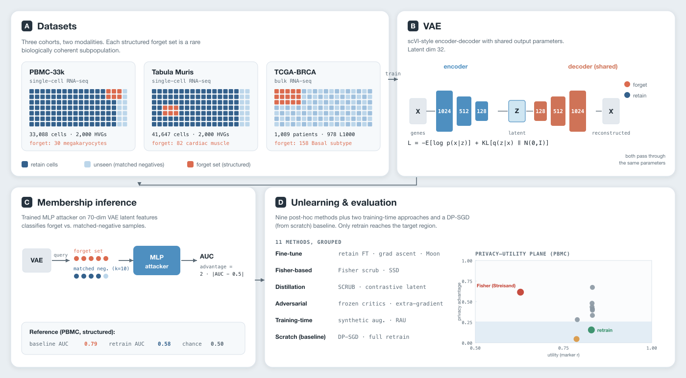

# Fishing for Privacy: Machine Unlearning for Gene-Expression VAEs

**Can a gene-expression VAE selectively forget a rare biological subpopulation without retraining and without destroying model utility? Eleven unlearning approaches fail across three datasets and two modalities. Fisher information overlap in the shared decoder output (~27x the classifier's) is the structural cause.**

David Benson, Columbia University

[View Code](https://github.com/db-d2/Machine_Unlearning) | [Writeup (Markdown)](./Writeup.md) | [Writeup (PDF)](./Writeup.pdf)

## Abstract

Variational autoencoders trained on gene-expression data memorize rare biological subpopulations, and those are the samples where a membership inference attack (MIA) is most dangerous. A few patients with an unusual disease subtype, or a small cluster of rare cells, can be individually identifiable from model behavior. Can such memorization be selectively removed without retraining the model, and without destroying its utility? That requires fixing the measurement first. MIA protocols that draw matched negatives from different biological classes than the forget set can conflate subtype identity with training membership, and this confound affects general-purpose attacks (threshold, likelihood ratio, k-NN) along with the distance-based methods used in recent transcriptomics benchmarks. Within-subtype matching, a trained MLP attacker on model-internal features, and a multi-seed retrain baseline recover a smaller memorization signal that sits almost entirely in biologically coherent subpopulations. Under this corrected evaluation, eleven unlearning approaches all fail on structured forget sets across three datasets (PBMC-33k, Tabula Muris, TCGA-BRCA) and two modalities. Methods that preserve utility produce no privacy improvement. The methods that do reduce the membership signal destroy the model through posterior collapse or Streisand effects. The underlying cause is structural. Fisher information overlap in the VAE's shared decoder output layer is roughly 27x higher between forget and retain sets than in a classifier's class-specific output (0.485 vs 0.018 under a per-sample estimator), and Proposition 1 formalizes why. With D shared output dimensions the overlap grows as 1 - O(M/D), while a classifier's class-specific heads give overlap O(1/sqrt(C)). If privacy actually matters, retrain.

## Contributions

1. **A corrected evaluation protocol** for MIA on biological generative models. Cross-class matched-negative protocols can conflate cell-type identity with training membership. Within-subtype matching, a trained attacker on model-internal features, a multi-seed retrain baseline, and attack diversity analysis isolate the genuine memorization signal.
2. **A systematic evaluation** of eleven unlearning approaches (nine approximate methods plus training-time synthetic augmentation and representation alignment) across three datasets and two modalities. On structured forget sets, every method either fails to reduce the signal or reduces it but destroys model utility. On TCGA-BRCA, no genuine memorization is detectable under the attack suite after within-subtype correction.
3. **A structural explanation** via Fisher information overlap. The VAE's shared decoder output layer creates roughly 27x higher Fisher alignment between forget and retain sets than a classifier's class-specific output (0.485 vs. 0.018 on PBMC; 0.75 on TCGA-BRCA), while the global-parameter cosine is 0.21. Proposition 1 formalizes this for linear decoders, with dimensional scaling bounds showing generative-model overlap grows as 1 - O(M/D) while classifier overlap scales as 1/sqrt(C).

## Key Results

All methods on PBMC-33k structured forget set (cluster 13, n = 30 megakaryocytes). Advantage = 2|AUC - 0.5|. Scoring is CPU-deterministic with a single attacker applied to every model, since MPS is not bit-reproducible run to run. Each method is compared to the multi-seed retrain reference by a nested bootstrap of the advantage difference, and a method fails when its point advantage exceeds the retrain 95% CI upper bound (0.258).

| Method | Seeds | AUC | Advantage [95% CI] | Marker r | Status |
|---|---|---|---|---|---|
| Baseline (no unlearning) | 1 | 0.791 | 0.582 | 0.831 | anchor |
| Retain-only fine-tune | 5 | 0.666 | 0.333 [0.23, 0.43] | 0.832 | FAIL |
| Gradient ascent | 5 | 0.698 | 0.396 [0.30, 0.49] | 0.832 | FAIL |
| SSD (alpha=1.0) | 3 | 0.718 | 0.435 [0.31, 0.56] | 0.831 | FAIL |
| SCRUB (alpha_f=1.0) | 3 | 0.706 | 0.411 [0.28, 0.54] | 0.832 | FAIL |
| Moon feature-unlearn | 3 | 0.740 | 0.480 [0.36, 0.60] | 0.831 | FAIL |
| Contrastive latent (gamma=1.0) | 3 | 0.164 | 0.673 [0.57, 0.75] | 0.832 | FAIL (Streisand) |
| Fisher scrubbing | 1 | 0.808 | 0.615 [0.45, 0.77] | - | FAIL (worse) |
| Extra-gradient (lambda=10) | 10 | 0.433 | 0.281 [0.20, 0.37] | 0.789 | FAIL (marginal) |
| DP-SGD (epsilon=10) | 3 | 0.478 | 0.045 [0.03, 0.18] | 0.787 | ~ retrain\* |
| **Full retrain (multi-seed)** | **5** | **0.578** | **0.156 [0.08, 0.26]** | **0.829** | **TARGET** |

Retrain advantage = 0.156, nested 95% CI [0.082, 0.258]. Every post-hoc method's point advantage exceeds this bound. All except extra-gradient also have an advantage-difference CI that excludes zero. Extra-gradient is the one borderline case, its point advantage (0.281) above the bound while its difference from retrain is not statistically resolved.

\*DP-SGD reaches an advantage (0.045) indistinguishable from retrain but trains from scratch with a formal privacy guarantee. It is privacy by exclusion, not unlearning. Reported for reference.

## Main Figures

### Evaluation pipeline

*Three cohorts across two modalities, each with a structured forget set that is a rare, biologically coherent subpopulation; scVI-style VAE with shared decoder; trained MLP attacker on 70-dim latent features; eleven unlearning approaches (nine post-hoc, two training-time) plus DP-SGD on the privacy-utility plane.*

### MIA advantage by method

*MIA advantage by method on PBMC-33k structured forget set. The dashed line marks the 5-seed retrain advantage mean (0.156) with shaded nested 95% CI [0.082, 0.258]. No post-hoc unlearning method reaches the retrain CI.*

### Privacy-utility tradeoff

*Left: advantage vs. ELBO. Right: advantage vs. marker gene correlation. Methods that preserve utility fail on privacy; methods that reduce advantage pay a utility cost. Only retrain achieves both.*

### Fisher information overlap

*Per-parameter Fisher magnitude (log scale) for forget vs. retain sets. Left: VAE parameters are correlated (log-Fisher r = 0.73). Right: classifier parameters show no correlation (cosine = 0.018).*

### Biology confound across datasets

*Cross-subtype vs. within-subtype MIA AUC for PBMC and TCGA-BRCA. With within-subtype matching, baseline and retrain AUCs converge, showing that most of the apparent cross-subtype memorization signal is subtype identity rather than membership.*

## Key Findings

1. **Memorization is structured.** Coherent biological clusters have baseline MIA AUC of 0.79-0.89. Scattered random cells have AUC of 0.41-0.53. The unlearning problem only matters for structured sets.

2. **All nine post-hoc methods fail.** Every multi-seed method's point advantage sits above the retrain CI upper bound (0.258). Five preserve utility but produce no privacy gain, including Moon feature unlearning, which fine-tunes only the decoder and holds marker r at baseline (0.831) yet leaves advantage at 0.480 because most of the attacker's signal comes from the untouched encoder. Three methods (contrastive, Fisher, frozen critics) create detectable artifacts (Streisand effect). Extra-gradient has high variance, fails on Tabula Muris, and is the one method whose separation from retrain is not statistically resolved.

3. **Two constructive approaches also fail.** Training-time synthetic augmentation shifts the memorization bias to the seed samples rather than removing it. Representation alignment unlearning (RAU) matches the retrain posterior on forget samples but creates a detectable Streisand effect; the structural limit extends from parameter space to representation space.

4. **The biology confound is real.** Within-subtype matching drops baseline AUC from 0.769 to 0.527 on PBMC (5 unseen megakaryocytes) and converges baseline and retrain AUCs to 0.576 on TCGA-BRCA. Cross-class matched-negative protocols, as used in e.g. Ozturk et al. (2026) and partly Golob et al. (2026), can conflate cell-type identity with training membership. The TCGA-BRCA within-subtype evaluation shows no baseline-vs-retrain gap at any patient-level forget size (n=5, 10, 20, 158). A second rare PBMC cluster (cluster 12, 49 cells) confirms the pattern: a model retrained without those cells still reaches advantage 0.64 versus baseline 0.73, and the extra-gradient setting competitive on cluster 13 over-unlearns here, so the failure is not a one-cluster artifact.

5. **Fisher overlap explains why.** The VAE's shared decoder output layer has Fisher cosine 0.485 between forget and retain sets, ~27x higher than a classifier's class-specific output (0.018); the global-parameter cosine is 0.209. On TCGA-BRCA the global cosine is 0.75. Proposition 1 formalizes the gap for linear decoders, with Corollary 2 showing it scales as 1 - O(M/D) for generative models vs. 1/sqrt(C) for single-class classifier forget sets.

6. **The gap is architectural, not capacity-based.** A deep MLP classifier (1.09M params) has the same low output-layer overlap (0.006) as a linear probe (0.018). Shared hidden layers match VAE encoder overlap (0.53 vs. 0.35). Overlap depends on shared-vs-class-specific parameters.

7. **Reducing latent dimension does not help.** A VAE with z=8 gives higher global Fisher overlap (0.35) than z=32 (0.21).

8. **Conditional decoders are insufficient.** A cluster-conditional VAE achieves near-zero overlap in class-specific output columns (~1e-8) but irreducible overlap persists in the shared encoder (0.433) and hidden layers (0.346). Fisher scrubbing on the conditional VAE gives no privacy improvement.

## Fisher overlap summary

| Layer category | Parameters | PBMC cosine |
|---|---|---|
| VAE encoder | 2,642,816 | 0.273 |
| VAE bottleneck | 8,256 | 0.291 |
| VAE decoder hidden | 598,912 | 0.232 |
| VAE decoder output | 4,100,000 | 0.493 |
| **VAE global (PBMC)** | **7,349,984** | **0.209** |
| **VAE global (TCGA-BRCA)** | **~4.2M** | **0.753** |
| **Classifier (linear)** | **462** | **0.018** |

Multi-seed method and retrain numbers traceable to `outputs/p4/multiseed/nested_ci_all.json` (CPU one-attacker re-score); Fisher cosines to `outputs/p6/fisher_overlap_results.json`.

## Documentation

[Writeup (Markdown)](./Writeup.md) | [Writeup (PDF)](./Writeup.pdf) | [LaTeX source](./Writeup.tex)

## Reproducing results

Run notebooks in numerical order (01-40). Key notebooks:

- **NB01-10**: Data prep, baseline training, initial unlearning experiments
- **NB11-25**: Additional methods, cross-dataset validation, ablations, attack diversity
- **NB26**: Canonical Fisher overlap analysis (VAE vs classifier, damping=1e-8)
- **NB27**: Deep MLP classifier (fair capacity comparison)
- **NB28**: VAE z=8 (architecture generalization)
- **NB29**: Conditional VAE (cluster-specific output columns)
- **NB30**: Proposition 1 verification + conditional VAE scrubbing
- **NB31-36**: TCGA-BRCA data prep, baseline, unlearning, within-subtype evaluation, Fisher overlap, cross-domain comparison
- **NB37**: Synthetic augmentation experiments
- **NB38**: Representation alignment unlearning (RAU)
- **NB39**: Larger-cluster within-subtype evaluation (PBMC c7, TM c28)
- **NB40**: Confound fraction CIs (parametric bootstrap)

To reproduce the multi-seed retrain reference and nested bootstrap pipeline:

```bash
# Train 5 retrain seeds (canonical protocol)
for SEED in 42 43 44 45 46; do
    PYTHONPATH=src python src/retrain.py \
        --data_path data/adata_processed.h5ad \
        --forget_set_path outputs/p1/split_structured.json \
        --output_dir outputs/p1/multiseed_retrain/seed_$SEED \
        --hidden_dims 1024 512 128 --latent_dim 32 \
        --likelihood nb --use_layer_norm --dropout 0.1 \
        --kl_warmup_epochs 20 --free_bits 0.03 \
        --seed $SEED --epochs 100 --batch_size 256 --lr 1e-4
done

# Run nested bootstrap + hypothesis tests
PYTHONPATH=src python scripts/nested_bootstrap_retrain.py
```

---

*Columbia University. Code: <https://github.com/db-d2/Machine_Unlearning>*
